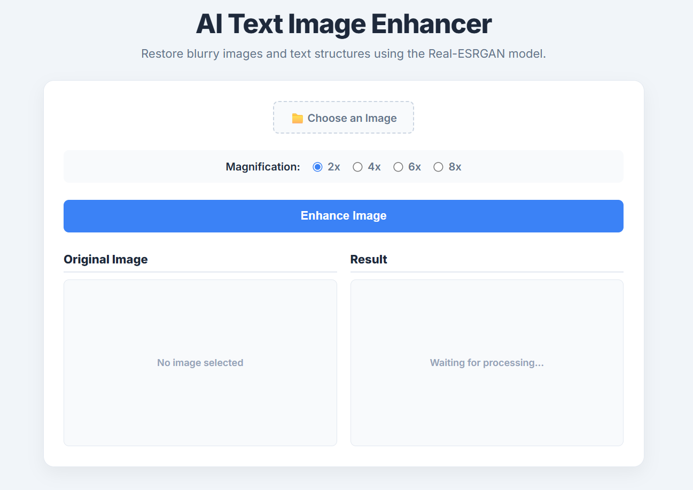

<p align="center">

</p>

<div align="center">

# TextClear AI

**[English](README.md) | 繁體中文**

</div>

### AI 影像文字清晰化工具

TextClear AI 是一款輕量化的桌面應用程式，專為改善圖片中模糊文字而設計。專案整合 **Real-ESRGAN** 深度學習模型與 **ONNX Runtime** 推論引擎，提供快速、離線且重視隱私的 AI 影像增強方案，無需任何雲端服務即可完成圖片文字清晰化。

---

# ✨ 功能特色

- **離線 AI 推論**
  - 全程於本機執行影像增強，不需上傳圖片。
  - 採用 ONNX Runtime，不需任何雲端 API 或網路連線。

- **AI 文字清晰化**
  - 利用 Real-ESRGAN 模型修復模糊文字並提升影像解析度。
  - 適用於 AI 生成圖片、螢幕截圖、文件照片及低解析度圖片。

- **現代化桌面介面**
  - 使用 **FastAPI + PyWebView** 建構桌面應用程式。
  - 以 HTML、CSS、JavaScript 打造美觀且易於操作的介面。

- **Windows 獨立執行檔**
  - 透過 PyInstaller 打包成 `.exe`。
  - 使用者無需安裝 Python，即可直接執行。

- **模組化架構**
  - 前端介面與 AI 推論邏輯完全分離。
  - 方便後續維護、功能擴充及更換 AI 模型。

---

# 執行展示

<p align="center">

</p>

# 技術架構

| 元件 | 技術 |
|------|------|
| AI 模型 | Real-ESRGAN |
| 推論引擎 | ONNX Runtime |
| 後端 | FastAPI |
| 桌面框架 | PyWebView |
| 前端 | HTML / CSS / JavaScript |
| 打包工具 | PyInstaller |

---

# 專案結構

```text
TextClearAI/
├── main.py                      # FastAPI 伺服器與 PyWebView 啟動程式
├── weights/
│   ├── RealESRGAN_x4plus_fp32.onnx
│   └── RealESRGAN_x4plus_fp32.onnx.data
├── static/
│   ├── index.html
│   ├── css/
│   └── js/
├── image/
│   └── icon.ico
├── requirements.txt
├── .gitignore
└── README.md
```

---

# 開始使用

## 方法一：下載可執行版本

1. 前往 **Releases** 頁面。
2. 下載最新版 **TextClearAI_vX.X.zip**。
3. 解壓縮至任意資料夾。
4. 雙擊 **TextClearAI.exe** 即可開始使用。

> 無需安裝 Python 或其他相依套件。

---

## 方法二：從原始碼執行

### 1️⃣ 複製專案

```bash
git clone https://github.com/yian3690/TextClearAI.git
cd TextClearAI
```

### 2️⃣ 建立虛擬環境

```bash
python -m venv .venv
```

Windows 啟用虛擬環境：

```bash
.venv\Scripts\activate
```

### 3️⃣ 安裝相依套件

```bash
pip install -r requirements.txt
```

---

# 下載模型權重

請確認 **weights/** 資料夾中包含以下兩個檔案：

```text
weights/
├── RealESRGAN_x4plus_fp32.onnx
└── RealESRGAN_x4plus_fp32.onnx.data
```

---

# 執行程式

```bash
python main.py
```

---

# 打包成執行檔

```bash
pyinstaller ^
--name "TextClearAI" ^
--windowed ^
--icon="image/icon.ico" ^
--add-data "weights;weights" ^
--add-data "static;static" ^
--hidden-import uvicorn ^
--hidden-import fastapi ^
main.py
```

---

# 貢獻專案

歡迎任何形式的貢獻！

1. Fork 本專案
2. 建立新的功能分支

```bash
git checkout -b feature/your-feature
```

3. 提交修改

```bash
git commit -m "Add new feature"
```

4. 推送至 GitHub

```bash
git push origin feature/your-feature
```

5. 建立 Pull Request

---

# 未來規劃

- 整合 OCR（PaddleOCR / EasyOCR）
- 支援拖曳圖片上傳
- 支援批次圖片處理
- GPU 加速推論
- 支援更多超解析模型
- 支援 Linux 與 macOS

---

# 授權

本專案採用 **MIT License**。

本專案所使用的 **Real-ESRGAN** 模型及其預訓練權重，皆遵循原作者所提供之開源授權條款。
